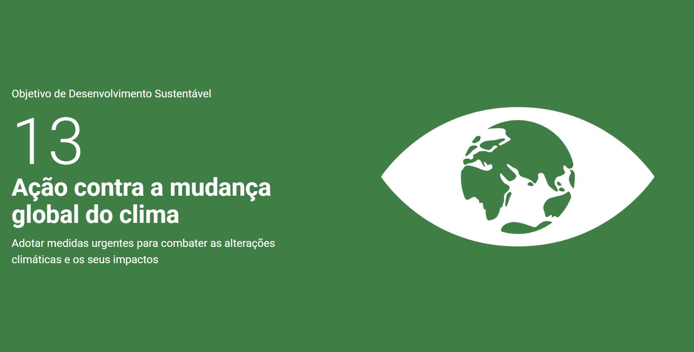

# Hackaton - Ação contra a mudança global do clima 🌍
### Adotar medidas urgentes para combater as alterações climáticas e os seus impactos 

Vivemos um momento de emergência ambiental sem precedentes. O projeto tem como tema central o Objetivo de Desenvolvimento Sustentável 13 (ODS 13) da ONU, que estabelece a necessidade de tomar medidas urgentes para combater as mudanças climáticas e seus impactos profundos no nosso planeta. 
***
  

## Membros e professor 👥

>[Arthur Faria e Silva](https://github.com/Arthur-2612)  
[Gustavo Leme](https://github.com/Gusleme) 
[Matheus Alves de Oliveira Souza](https://github.com/MatheusAlves08) 
[Nicolle Carolina da Rocha](https://github.com/Nickddb)

> [Repositório hackaton Deivison](https://github.com/deivisontakatu/aula-frameworks-frontend/blob/main/Projeto/Hackathon.md)

 

### [Deploy na Vercel](https://hackaton-ods-13-o3ejqfnce-nickddb.vercel.app/)
***

 

## Documentação do front-end

O guia de [tecnologias e arquitetura do front-end](./docs/tecnologias-frontend.md) descreve a stack React/TypeScript, a estrutura da aplicação, as rotas, a origem dos dados e os comandos de desenvolvimento e validação.

***

# Benchmarks

Análise de Benchmarking: Plataformas de Dados Climáticos e Notícias
Para embasar o desenvolvimento do projeto focado na ODS 13, foi realizado um benchmarking com quatro plataformas de referência no fornecimento de dados climáticos e ambientais: [Climatempo](https://www.climatempo.com.br/), [Nasa Science](https://science.nasa.gov/climate-change/), [Windy](https://www.windy.com/pt/-Menu/menu?radar,-22.459,-51.535,4,m:ercakXI) e [New York Times](https://www.nytimes.com/international/). A análise avaliou as funcionalidades, os pontos fortes e fracos (UX/UI) e o público-alvo de cada solução, gerando insights valiosos para a construção da nossa interface. 
***